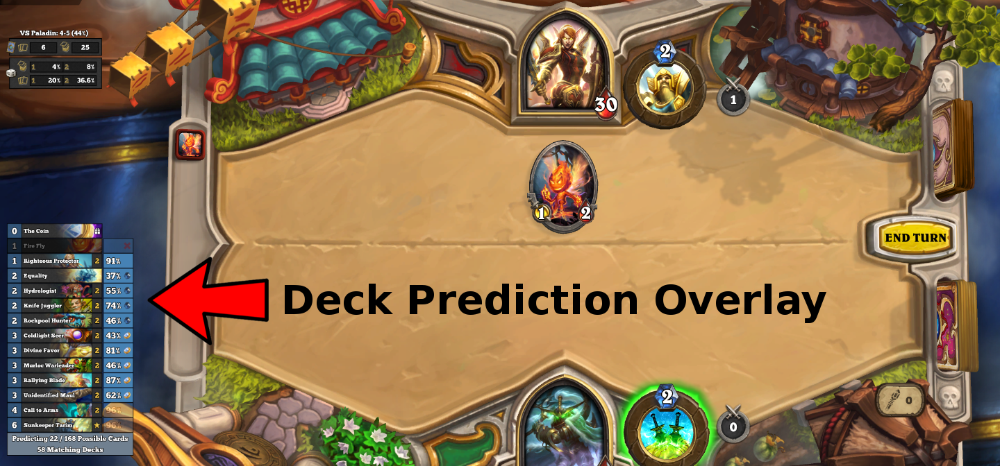
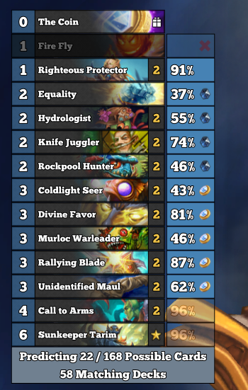

# HDT Deck Predictor

A Plugin for Hearthstone Deck Tracker (HDT) that predicts the opponent's decklist.

## Installation
- [Download and install HDT](https://hsdecktracker.net/).
- [Download the Deck Predictor Plugin](https://github.com/fatheroctopus/hdt-deck-predictor/releases/latest).
- Extract the downloaded archive to your "Plugins" directory.
  - This location can be found from within HDT: `Options -> Tracker -> Plugins -> Plugins Folder`.
  - Your directory structure should look like `%AppData%/HearthstoneDeckTracker/Plugins/DeckPredictor/DeckPredictor.dll`.
- Restart HDT and enable the plugin in `Options -> Tracker -> Plugins`.

## Disclaimer
Blizzard's stance on acceptable mods is that they accomplish things that could be done with "pencil and paper".
There's an argument to be made that a user could just have a tab open to an existing metagame site and use that to predict what cards the opponent may have in their deck.

Be aware that Blizzard may change or clarify their policy in the future, and you use this mod at your own risk.

## Features
While enabled, DeckPredictor will replace the standard HDT opponent deck list with a new overlay:

### Deck Prediction Details:
- All stats update in real time as the opponent plays cards.
- Each predicted card shows the percentage chance that this card is in the opponent's deck or hand.
- Percentages appear faded if the opponent cannot play this card on their next turn.
- Mana crystal icon appears next to cards that would spend all the opponent's available mana next turn.
- Coin icon apears next to cards that are playable next turn if the opponent uses their coin.
- X icon appears next to played cards that are outliers in the current meta. These cards are currently being ignored by the Predictor.
- Below the decklist, the overlay enumerates how many cards it is showing out of the total number of *Possible Cards* in the opponent's deck.
- *Matching Decks* is how many decks in the meta contain all the cards that the opponent has played.
- Like the HDT deck tracker, the overlay will also list Played, Created, and Jousted cards.

## How It Works

Deck Predictor uses the same aggregate data as [AdnanC's MetaDetector plugin](https://github.com/AdnanC/HDT.Plugins.MetaDetector) from [MetaStats](http://metastats.net/).

As the opponent plays cards, decks without those cards are filtered out, and each possible card is assigned a probability based on how often it appears in the list of possible decks.

The overlay does not display every possible card, but shows cards based on these heuristics:
 1. Cards that are sufficiently likely will usually be displayed.
 2. Cards that are playable on the opponent's next turn will often be favored over unplayable cards.
 3. Cards that are "optimal" for the opponent's next turn will often be favored over other playable cards.
 4. Around 30 cards should be shown.

The first and second copy of a card are tracked separately, but when showing both copies, the overlay will only display the probability of the first copy.

When a deck goes off-meta, one or more cards are deemed outliers and ignored by the prediction. Cards that appear in fewer decks with the other played cards are more likely to be judged as outliers.

## Known Issues
 - If you manage a service that aggregates statistics for the Hearthstone meta, I'd be interested in integrating with your data. Please create an issue or contact me directly.
 - There are still a few display bugs floating around when cards go back into the opponent's hand.
 - Deck popularity is not currently available from the meta data. If it were, all probabilities would be weighted by popularity.
 - Only works for Standard games at the moment since the available meta data has no Wild stats.
 - Predictions do not account for cards with variable mana cost (e.g. Molten Giant, Crystal Lion)
 - Upgraded Spellstones are not correctly identified with the non-upgraded versions of their cards.

## Feedback
I'll respond to any issues opened for bugs or feature requests.
This is my first time working in C# and WPF, so I'm also interested in any idioms or best practices I may have missed.

For problems with prediction results, please attach a screenshot of the issue and zip up the Logs directory at `%AppData%/HearthstoneDeckTracker/DeckPredictor/Logs`.
Try to do this immediately after the game finishes.

Check out my music on [bandcamp](https://fatheroctopus.bandcamp.com).  It's free.
